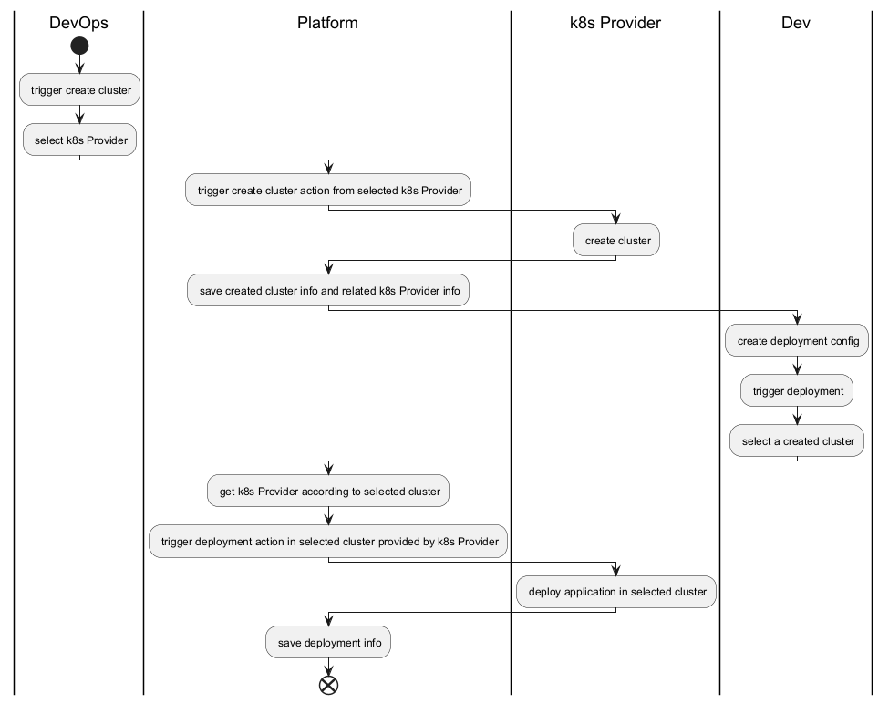

# k8s platform Project

## Requirements

You will design and develop a cloud-based Kubernetes SaaS service that enables users to create Kubernetes clusters, deploy applications, and host services. Rules to follow:

1. Use AWS as the cloud service provider.
2. Only EC2 can be used as the computing service.
3. Choose the smallest AWS resources available and inform the channel.
4. Start with project planning to produce a list of tasks required to move the project forward.

## Use Case

- as a devops, I could create cluster from platform
- as a devops, I could get cluster info from platform
- as a developer, I could deploy appliations from platform
- as a developer, I could get deployment status of application from platform

## Architecture Design

### Workflow

### Domain Model

- K8sProvider, it's a platform which provides k8s services
- Cluster, represent a k8s cluster in a specific k8s provider
- DeploymentConfig, it's used to deploy application into a selected cluster
- DeploymentConfigSnapshot, a clone of DeploymentConfig and generated when deployment happen.
- Deployment, represent an application deployment in specific Cluster

## Preparation

- k8s envrionment
- frontend and backend init project

## Plan schedule

Backlog list below, the details will be mentioned in its own page,
according to priority order from high to low:

1. DevOps set up k8s provider environment in local
2. Dev set up init project, include frontend and backend
3. User can create Cluster in platform
4. User can see list of Clusters
5. User can create DeploymentConfig in platform
6. User can select a DeploymentConfig to trigger deployment
7. User can see list of Deployment infos, include current status
8. integrate basic login support
9. integrate RBAC for user
10. assign permission to APIs accorind to design
11. Add support of AWS k8s provider support
